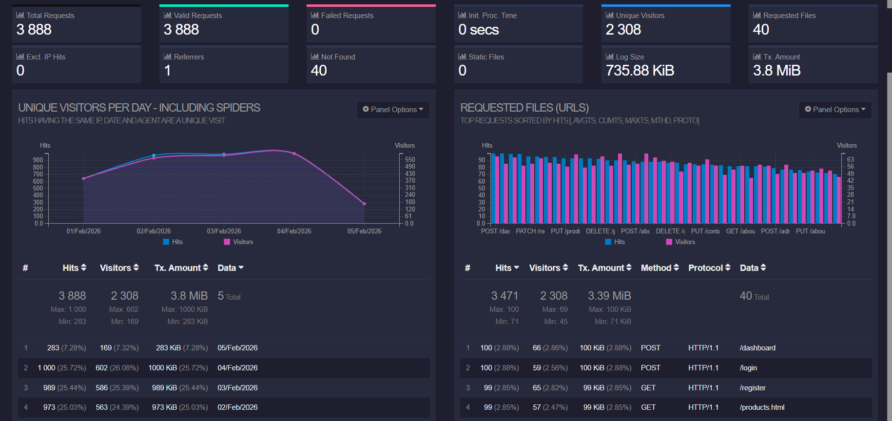
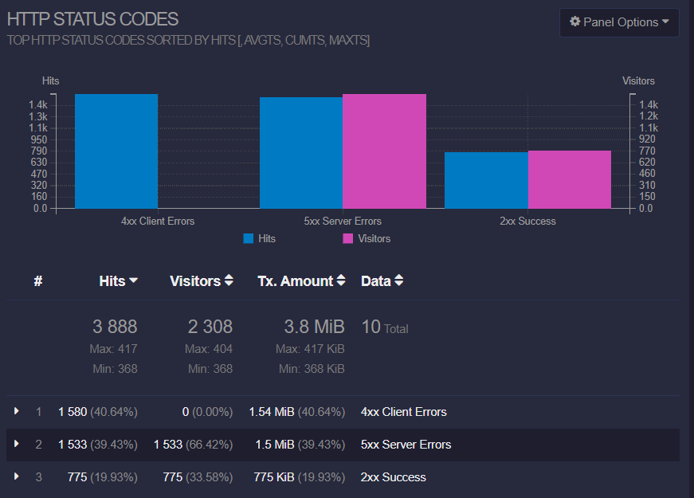
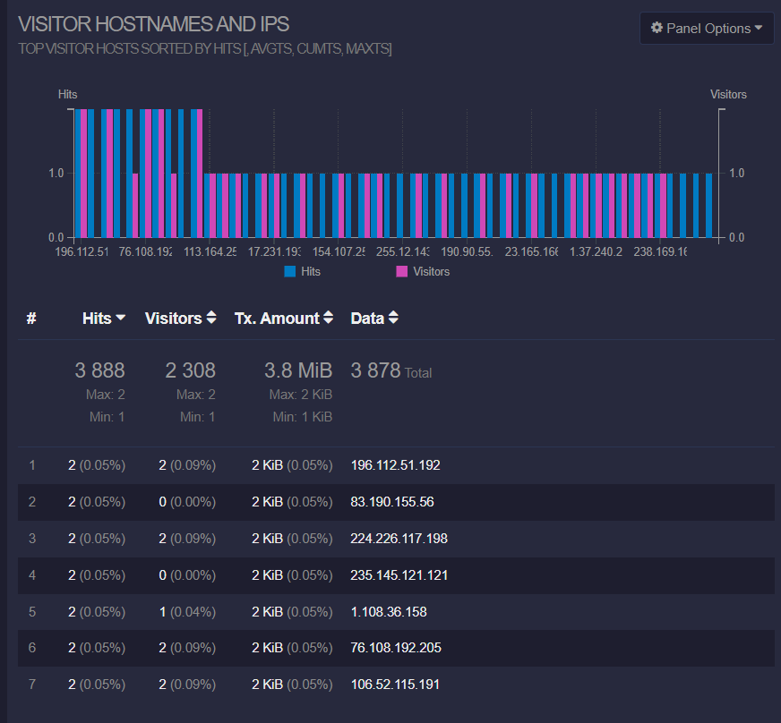
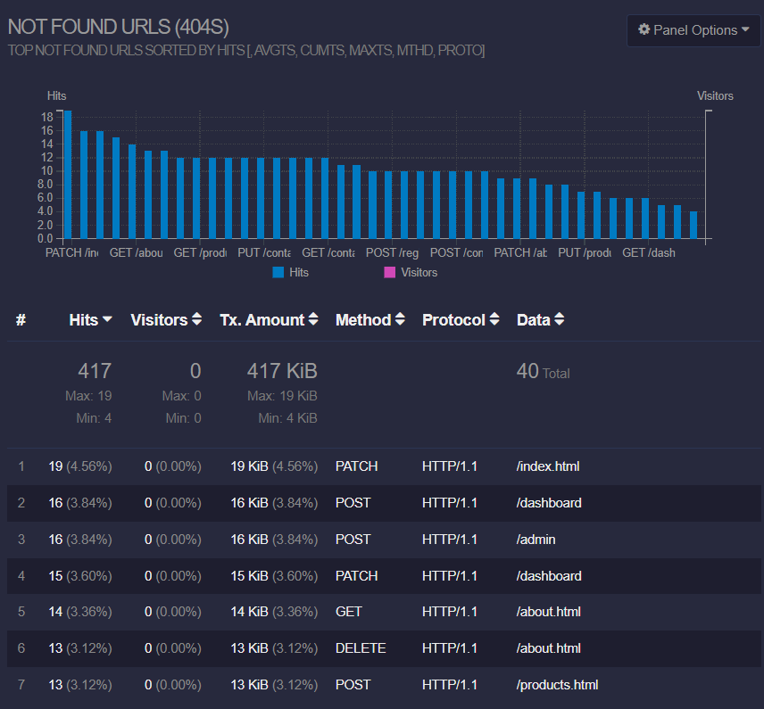

## Поднятие сервера и вебсокета

**HTTP сервер для отдачи HTML (порт 8000)**
```
python3 -m http.server 8000 --bind 0.0.0.0
```

**Вебсокет сервер для обновлений (порт 7890)**
```
goaccess access_*.log -o report.html --log-format=COMBINED --real-time-html --addr=0.0.0.0 --port=7890
```


## С помощью утилиты GoAccess получи информацию

1. **Все записи, отсортированные по коду ответа;** 

2. **Все уникальные IP, встречающиеся в записях;** 

3. **Все запросы с ошибками (код ответа — 4хх или 5хх);** 

4. **Все уникальные IP, которые встречаются среди ошибочных запросов.** 

