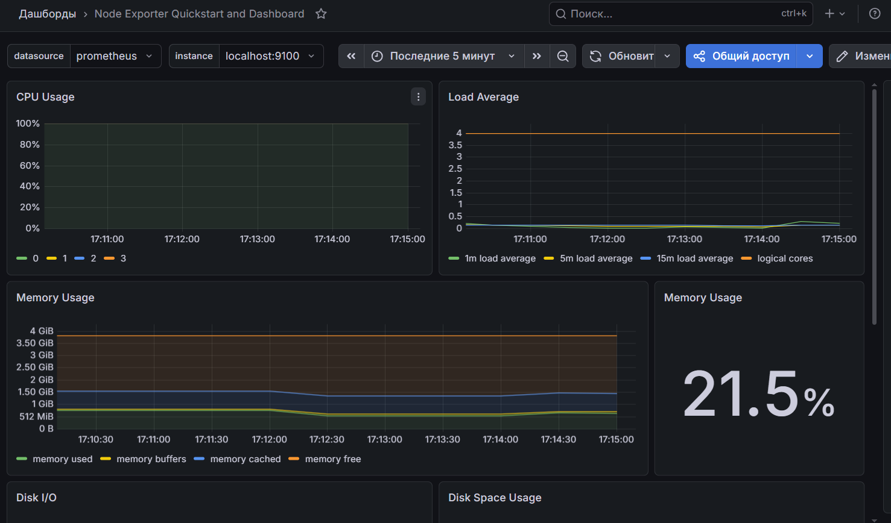
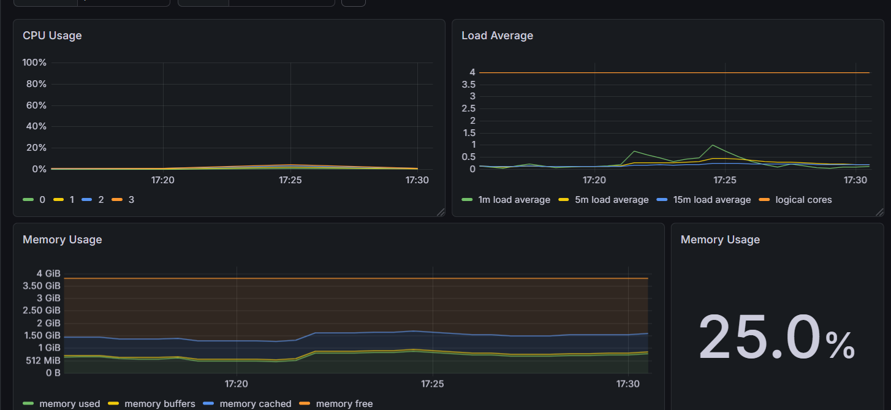
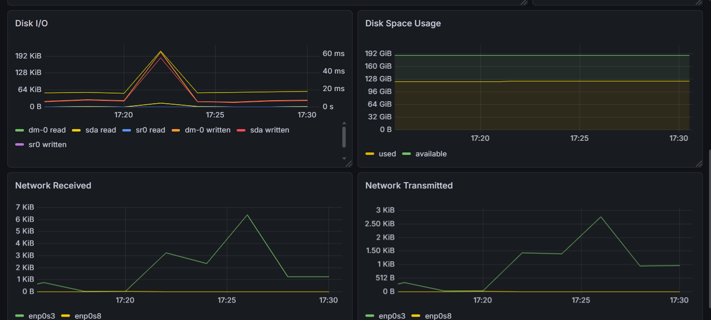
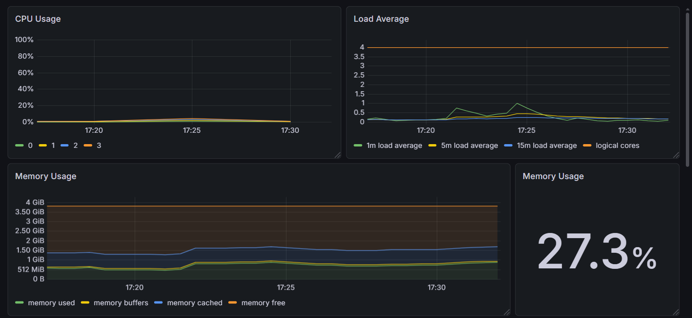
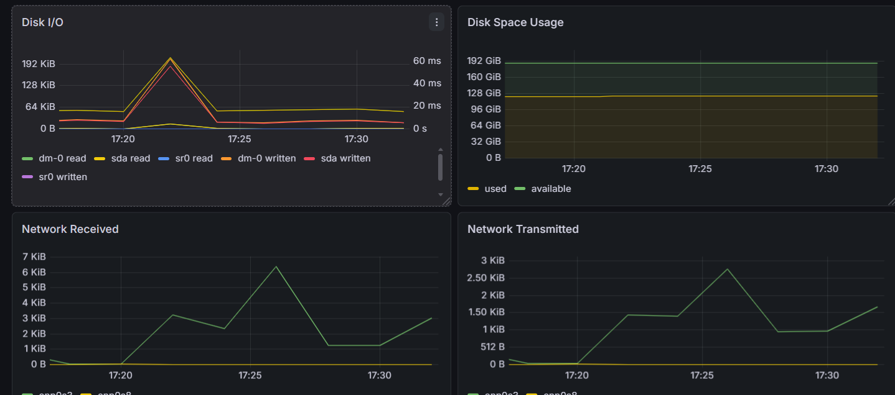
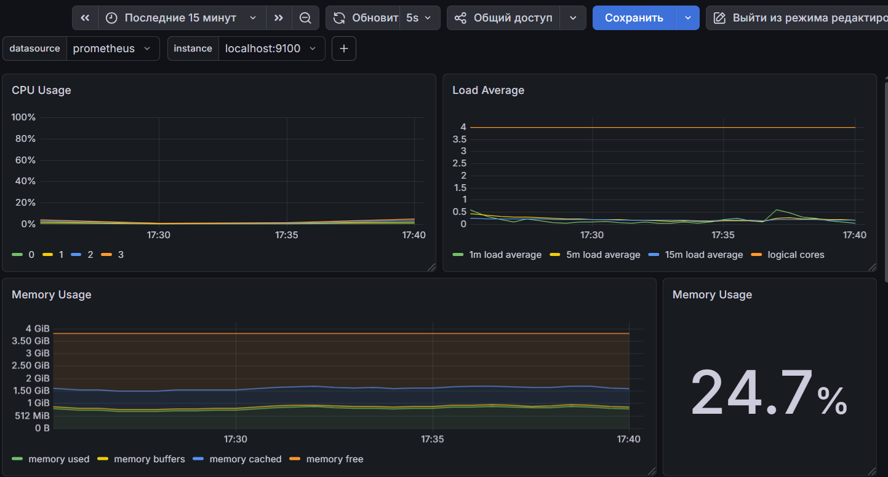
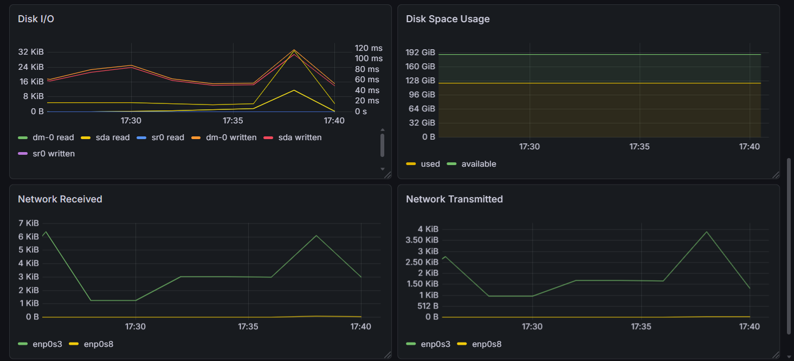
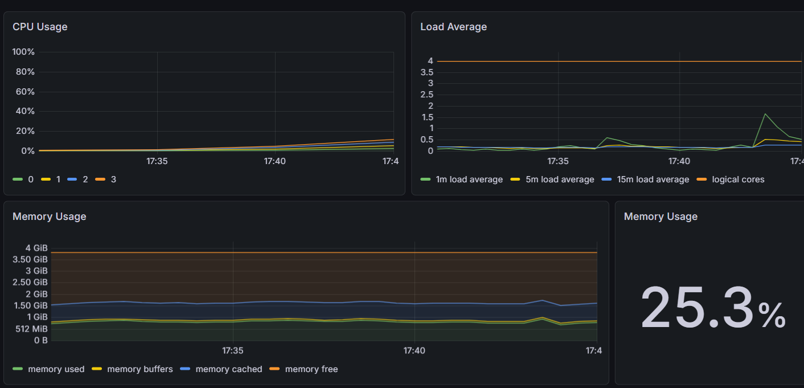
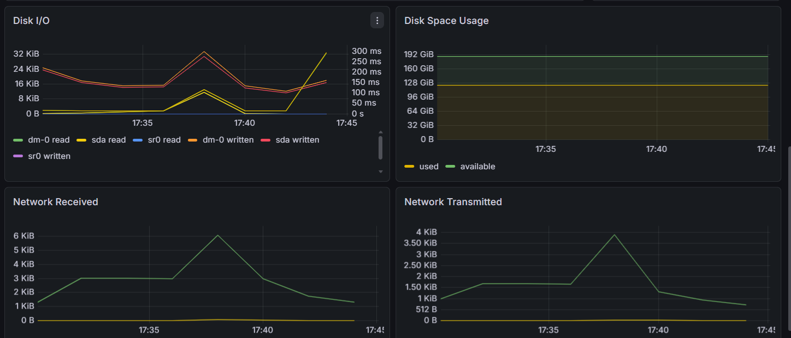
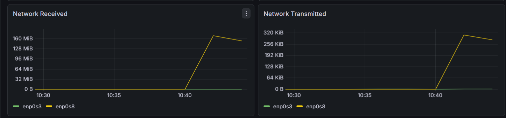

## Grafana Node exporter quickstart and dashboard
#### Node exporter quickstart and dashboard

До запуска скрипта из части 2

После отработки скрипта части 2

До запуска команды **stress -c 2 -i 1 -m 1 --vm-bytes 32M -t 10s** 

После запуска **stress -c 2 -i 1 -m 1 --vm-bytes 32M -t 10s** 

После запуска команды **stress -c 2 -i 1 -m 1 --vm-bytes 200M -t 30s** 

После запуска команды iperf3:
